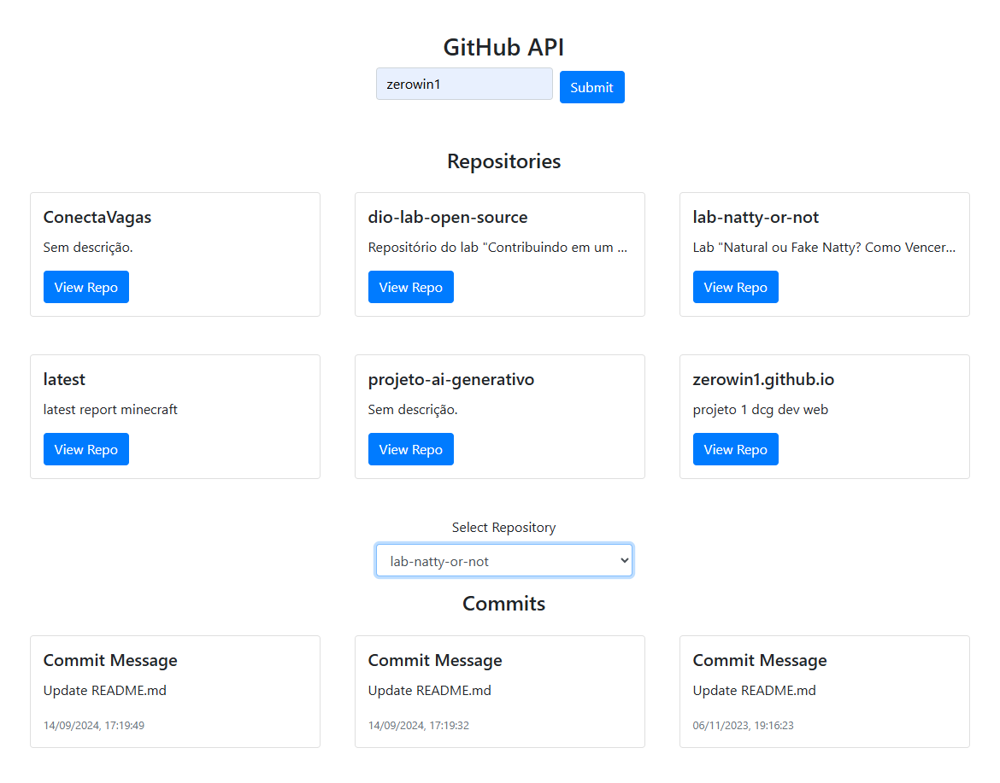

# Projeto2a: GitHub API e DOM Manipulation

.

#### Deploy

Preencha aqui a URL para acesso ao site publicado

#### Desenvolvedor(a)

Thales de Vargas Stamm

#### Ambiente de desenvolvimento

VS Code

#### Créditos

- https://codesnippet.io/github-api-tutorial/
- https://www.youtube.com/watch?v=7x3YrAiu5HI
- GPT
  

#### Bastidores

Tentei seguir o mesmo padrão de design do projeto original, alterando apenas o método de exibição, achei que do modo que fiz em cards com o bootstrap conseguiria aproveitar melhor a tela e troquei a URL pra um botão destacado... Na descrição de cada repo, passando um limite de caracteres ele apenas adiciona (...) no fim e corta para manter um padrão de tamanho.
Selecionando no dropdown um dos repositórios, são exibidos todos os commits, que escolhi não limitar o tanto de caracteres para a descrição. Estudei pelos tutoriais e fui desenvolvendo passo a passo, no caminho houveram alguns problemas, um foi que ao selecionar o repositório, o nome do usuário estava sendo perdido e acabava não retornando nada (não consegui desvendar o que estava causando), mas, com a ajuda do chatGPT, consegui contornar esse problema. O design ficou bem simples, mas acredito que a proposta esteja sendo cumprida.

---
Projeto entregue para a disciplina de [Desenvolvimento de Software para a Web](http://github.com/andreainfufsm/elc1090-2025a) em 2025a
